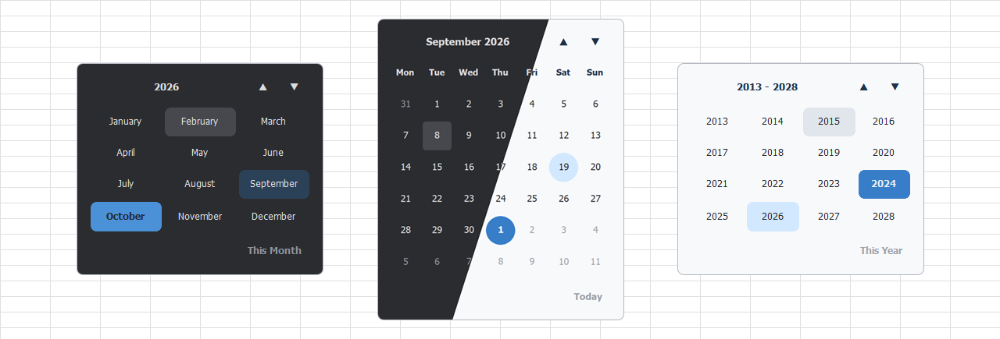

  

  <h1>Excel - Simple DatePicker</h1>
A simple and lightweight DatePicker for Excel, built entirely in VBA.

## 📝 Features

- Opens automatically when double-clicking a cell formatted as Date
- Supports light and dark mode with automatic detection
- Supports multiple languages based on Excel's interface language
- Fully responsive with adjustable size

> **Resizing:** To change the DatePicker size, modify the `DP_DATEPICKER_WIDTH` constant in `DP_modLayout`.

## ⚙️ Installation

The DatePicker requires **Microsoft Excel with VBA support and macros enabled**.

### Import the VBA components

> **Note:** If Windows has blocked the downloaded VBA component files, unblock them before importing.

1. Open your Excel workbook and press `Alt + F11` to open the VBA editor.
2. In the **Project Explorer**, select your workbook's VBA project.
3. Import the components from the corresponding folders in `src`:
   - **Class Modules** → import the `.cls` files
   - **Forms** → import the `.frm` files
   - **Modules** → import the `.bas` files
4. When importing a UserForm, keep its corresponding `.frx` file in the same folder as the `.frm` file.
5. From the `Microsoft_Excel_Objects` folder, copy the provided code into the corresponding module in your workbook.
6. Save your workbook as an `.xlsm` file.
7. Enable macros when prompted.

### Using the included demo

A ready-to-use example is available in `demo/Excel-SimpleDatePicker.xlsm`.  
Open the workbook and enable macros when prompted.

## 🔒 Security

The demo workbook contains VBA macros, so Excel may display the usual security warning when you open it.

If Windows has blocked the downloaded file, Excel may prevent the macros from running without offering an option to enable them.  
To unblock it, right-click the file, select **Properties**, check **Unblock**, then confirm.

The complete VBA source code is available in this repository for review.

## 🖥️ Compatibility

The DatePicker is designed for desktop versions of Microsoft Excel with VBA support.  
Older Excel versions may be compatible, but have not been tested against every release.

### macOS

The DatePicker supports Excel for Mac.  
For the optional automatic dark-mode detection, copy `DatePickerTheme.applescript` from `src/Mac/` to:

`~/Library/Application Scripts/com.microsoft.Excel/`

## 📌 Remarks

Supported formats include Excel's Short Date formats, the system-local Long Date format, and several common Long Date formats not tied to the system locale.  
Time-only formats are not supported, and custom date formats may not trigger the DatePicker.

The double-click behavior and which cell formats trigger the DatePicker can be customized in `DP_modHelpers`.

Excel Online includes a built-in date picker, but this feature is currently not available in the desktop version of Excel.

## 💙 Support

If you find a bug, open an issue.  
If you like this small project, leave a ⭐.

Thanks!
